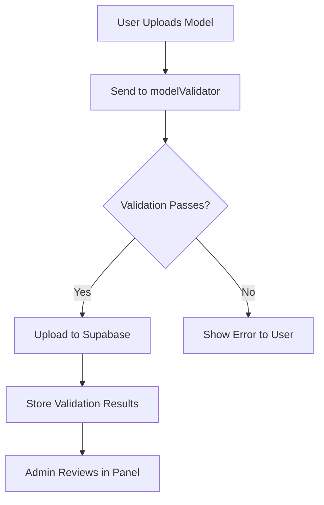

# ModelFlow Integration Guide

This guide explains how the Next.js ModelFlow application integrates with the Python modelValidator service.

## Integration Overview

The integration works as follows:

1. User uploads a model through the Next.js frontend
2. The model data is sent to the Python modelValidator service for validation
3. If validation passes, the model is uploaded to Supabase
4. Validation results are stored in the database for admin review
5. Admins can review validation results in the admin panel

## Integration Points

### Frontend Integration (`app/components/model/modelupload/modelUpload.jsx`)

The `handleSubmit` function now includes a validation step:

1. Sends model file and metadata to `http://127.0.0.1:8000/api/models/model-upload`
2. Waits for validation response
3. Proceeds with Supabase upload only if validation passes
4. Stores validation results in the database

### Backend Integration (`app/api/models/route.js`)

The POST route now handles the validation fields:

1. Parses validation results from the frontend
2. Stores validation data in separate columns:
   - `framework` - Detected framework
   - `task_type` - Detected task type
   - `validation_reason` - Detailed validation reason

### Database Integration (`scripts/add_validation_status_to_models.sql`)

New columns have been added to the models table:
- `framework` (TEXT) - Detected framework from the modelValidator service
- `task_type` (TEXT) - Detected task type from the modelValidator service
- `validation_reason` (TEXT) - Validation reason/details from the modelValidator service

### Admin Panel Integration (`app/admin/page.jsx`)

The admin panel now displays validation results:

1. Shows validation status with detailed reason
2. Displays detected framework and task type

## Running the Integration

1. Start the Next.js application:
   ```bash
   npm run dev
   ```

2. Start the modelValidator service:
   ```bash
   cd ../modelValidator
   uvicorn main:app --reload
   ```

3. Access the application at `http://localhost:3000`

## Testing the Integration

Run the test script to verify the modelValidator service is accessible:

```bash
python scripts/test_model_validator.py
```

## Migration

To apply the database changes, run:

```bash
psql -h your-supabase-host -d your-database -U your-username -f scripts/add_validation_status_to_models.sql
```

## Data Flow



## Validation Data Structure

The validation results stored in the database include:

```json
{
  "framework": "ONNX",
  "task_type": "image-classification",
  "validation_reason": "Detailed validation explanation"
}
```